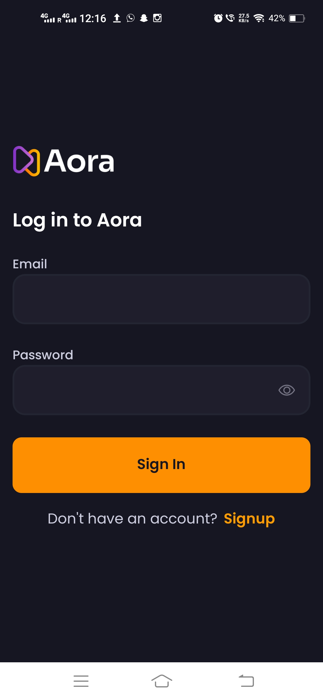
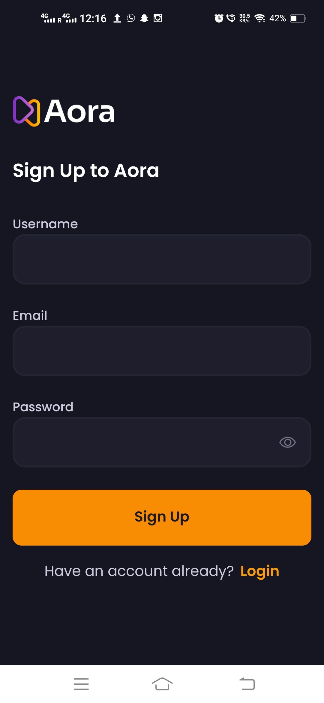

# Aora - Mobile Application

Aora is a mobile application built with React Native that allows users to sign in, sign up, create posts, bookmark videos, and view profiles. The app also includes a home tab with a search functionality to find videos, a bookmark videos tab, a create post tab, and a profile tab.

## Features

- **Sign In / Sign Up**: User authentication functionality.
- **Home Tab**: View videos, with a search bar to filter videos.
- **Bookmark Videos Tab**: Users can bookmark their favorite videos.
- **Create Post Tab**: Users can create and post videos or content.
- **Profile Tab**: Users can view and edit their profiles.
- **Search Functionality**: Search videos in the Home Tab.

## Screenshots

### 1. Sign In / Sign Up
<p float="left">


</p>

### 2. Home Tab with Search
<p float="left">
  
  
  
</p>


### 3. Create Post Tab


### 4. Profile Tab


### 5. Bookmark Tab


## Installation

To get started with this app locally, follow the steps below.

### Prerequisites

Ensure you have the following installed:
- Node.js (v16 or above)
- npm or yarn
- React Native CLI
- Expo CLI

### Steps to Install

### Step 1: Clone the repository to your local machine
```bash
git clone https://gitlab.com/rahul-malik1/aora-react-native.git
```

#### Navigate into the project directory
```bash
cd video-sharing-app
```
### Step 2: Install dependencies using npm (or yarn, if preferred)
#### If you're using npm:
```bash
npm install
```
#### If you're using yarn:
#### yarn install

### Step 3: Start the development server
```bash
npx expo start
```

### Step 4: Once the server is running, open the app in the Expo Go app on your mobile device
##### (available on iOS and Android) or use an emulator/simulator for testing.

#### For Android:
##### npx react-native run-android

#### For iOS (if on macOS):
##### npx react-native run-ios
